# Task Tracker API

Это backend на FastAPI. https://github.com/Desai0/ZZachet

Весь проект был в одном файле `main.py`, потом разнес код по файлам

## Что есть в проекте

- регистрация пользователя
- логин и получение токена
- получение текущего пользователя
- создание задач
- просмотр задач
- редактирование задач
- удаление задач
- просмотр пользователей админом

## Структура

```text
app/
├─ main.py
├─ config.py
├─ database.py
├─ models.py
├─ schemas.py
├─ security.py
├─ repositories.py
├─ dependencies.py
├─ routers/
│  ├─ auth.py
│  ├─ tasks.py
│  └─ admin.py
└─ services/
   ├─ auth.py
   └─ tasks.py
```

Коротко по файлам:

- `config.py` - настройки
- `database.py` - база и подключение
- `models.py` - модели SQLAlchemy
- `schemas.py` - схемы Pydantic
- `security.py` - токены и пароли
- `repositories.py` - запросы в базу
- `services/` - основная логика
- `routers/` - маршруты FastAPI
- `dependencies.py` - зависимости

## Маршруты

- `POST /auth/register`
- `POST /auth/login`
- `GET /auth/me`
- `POST /tasks/`
- `GET /tasks/`
- `GET /tasks/{task_id}`
- `PATCH /tasks/{task_id}`
- `DELETE /tasks/{task_id}`
- `GET /admin/users`

## Как запускать

Через docker compose:

```bash
docker compose up --build
```

После этого Swagger должен открываться тут:

```text
http://localhost:8000/docs
```

Если запускать без Docker:

```bash
pip install -r requirements.txt
uvicorn app.main:app --reload
```

Или так:

```bash
uvicorn main:app --reload
```

## Что используется

- FastAPI
- SQLAlchemy
- SQLite
- JWT
- passlib + bcrypt
- Redis
- Docker

# Скрины

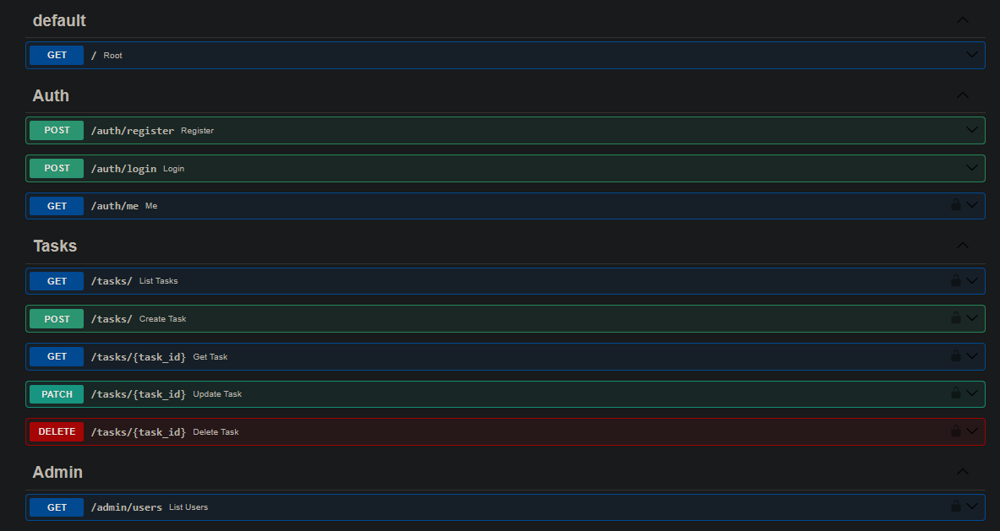

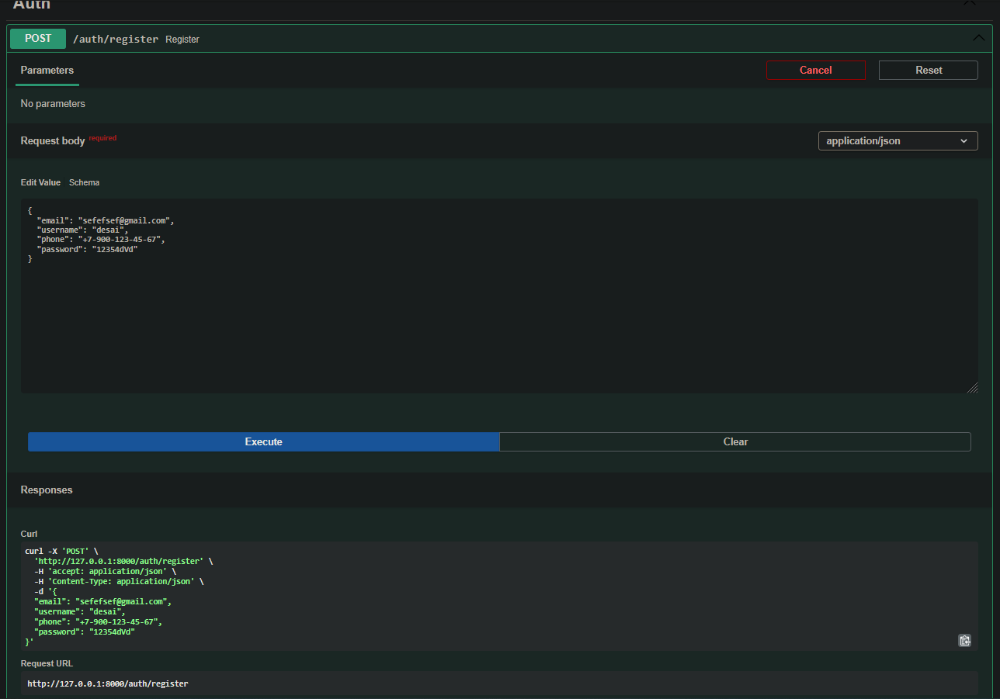

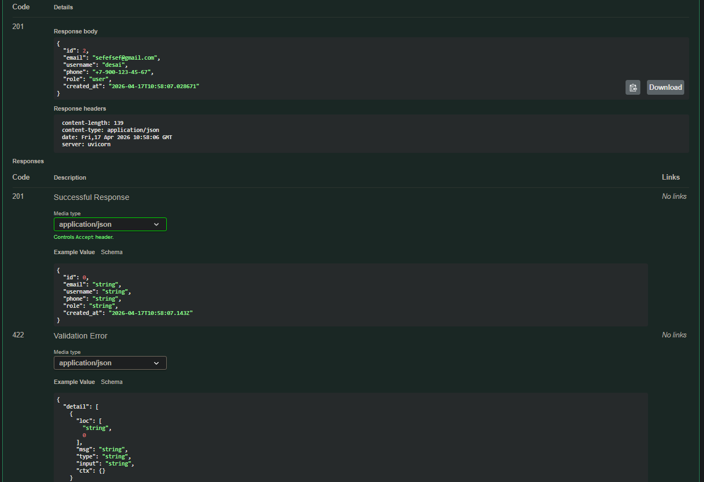

---

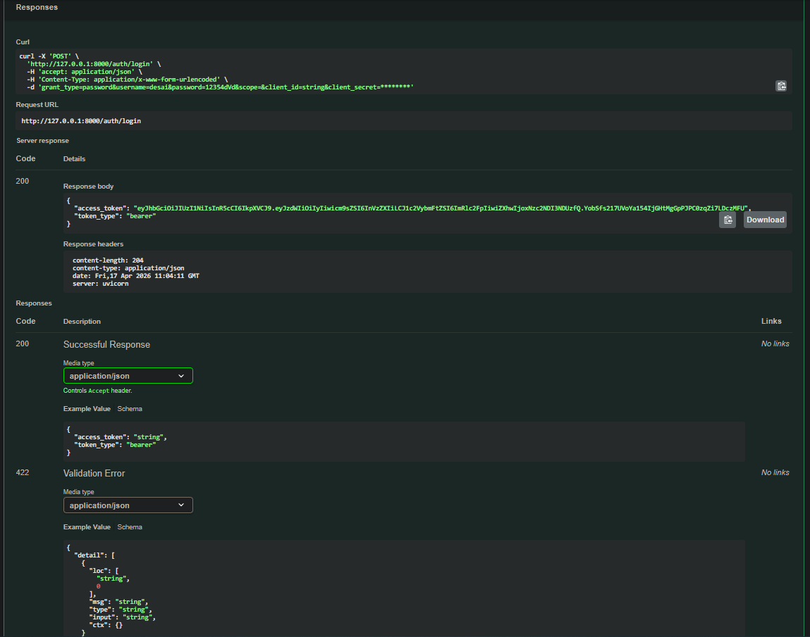

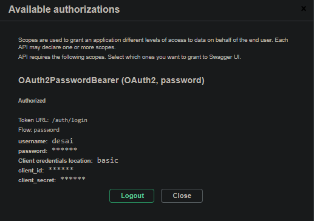

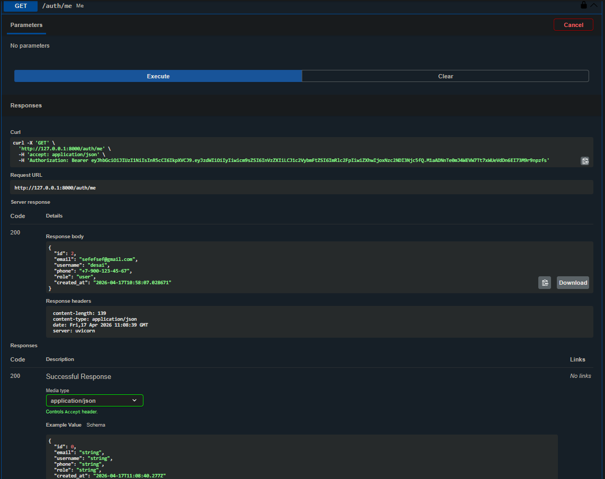

---

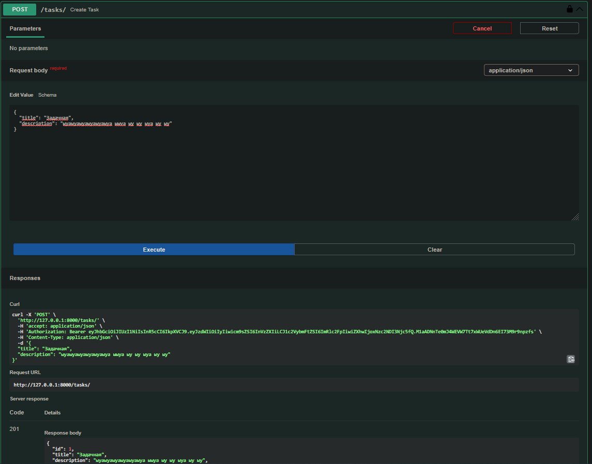

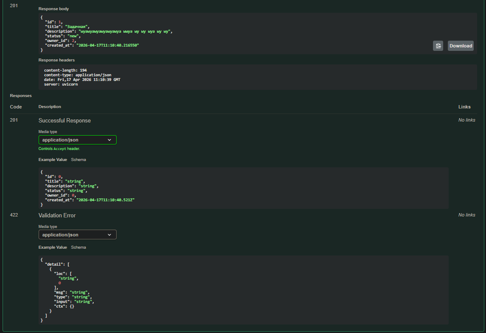

---

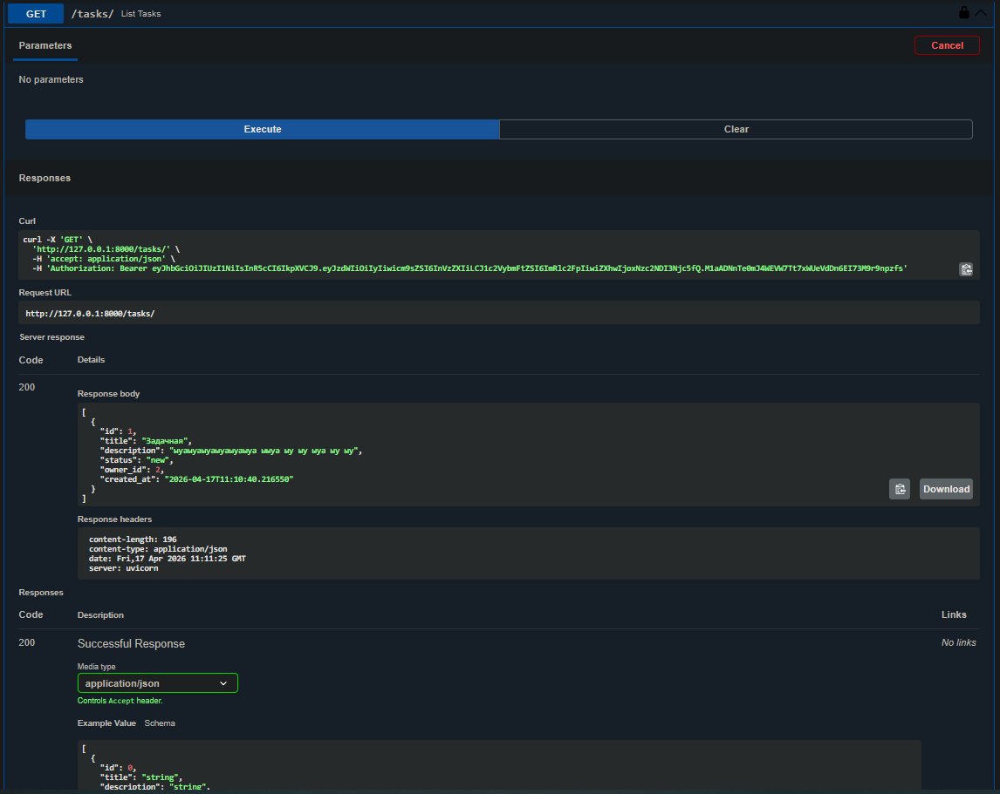

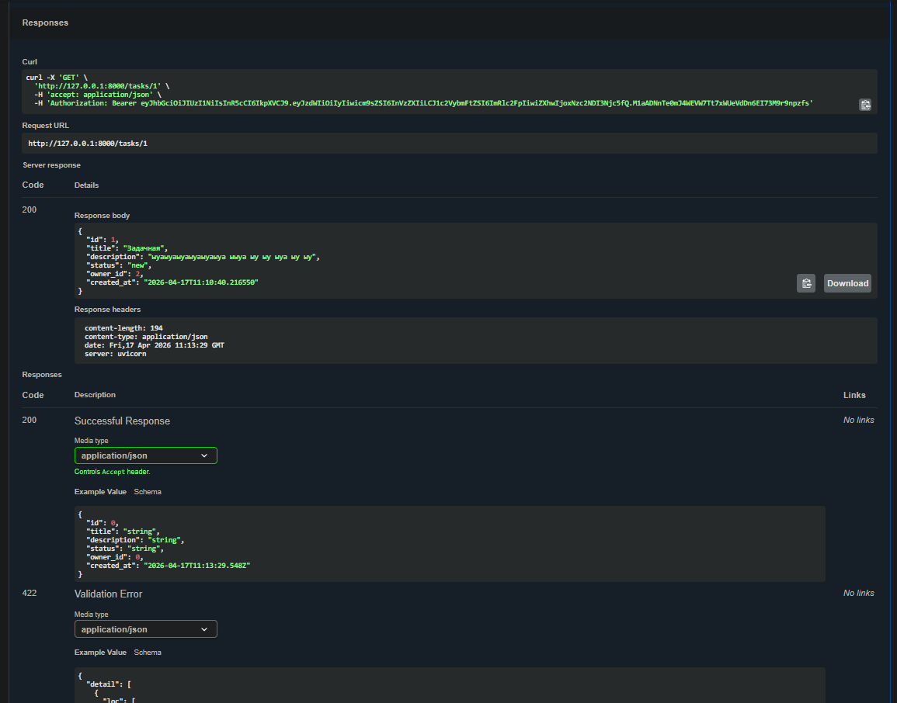

---

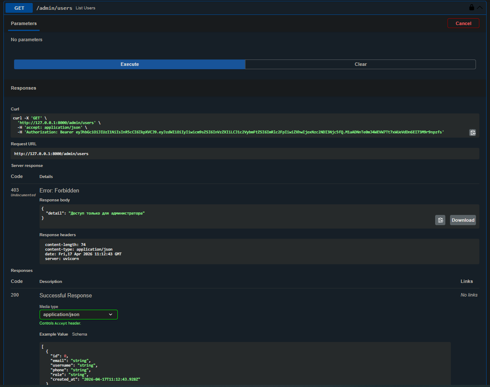
